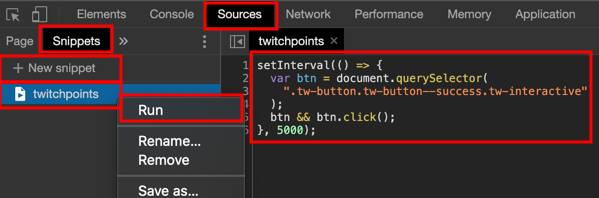

### Get +50 twitch points by automising click process in Chromium based browsers

Open Developer Tools by ```right mouse click => Inspect```

```Javascript
setInterval(() => {
  var btn = document.querySelector(
    ".tw-button.tw-button--success.tw-interactive"
  );
  btn && btn.click();
}, 5000);
```



#### What does code mean?

```Javascript
// sets interval for searching +50 button
setInterval(() => {
  // queries DOM for button
  var btn = document.querySelector(
    ".tw-button.tw-button--success.tw-interactive"
  );
  // checks if button present, if so clicks
  btn && btn.click();
  // searches for button each 5000 miliseconds
}, 5000);
```

#### Will it load automatically?

No, you have to run it again on page reload. If you wanna automate you need to find Chromium extension.


